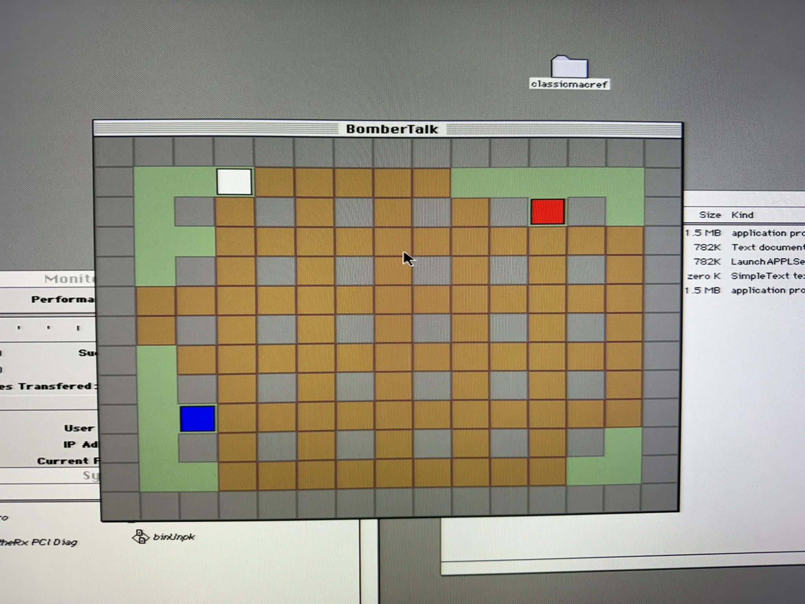
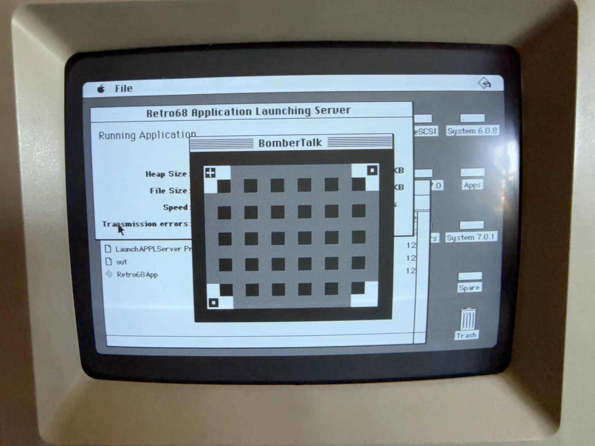
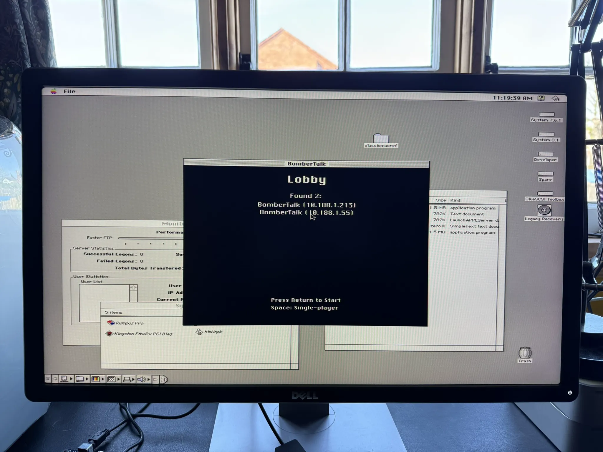

# BomberTalk

A networked Bomberman clone for Classic Macintosh, built to prove the [PeerTalk](https://github.com/matthewdeaves/peertalk) SDK works across three generations of Mac hardware.

Read the full write-up: [BomberTalk Alpha](https://matthewdeaves.com/blog/2026-04-06-bombertalk-alpha/)

<p align="center">
  
  
</p>
<p align="center">
  <em>Performa 6400 (colour, 32x32 tiles) and Mac SE (monochrome, 16x16 tiles) running the same game</em>
</p>

<p align="center">
  
</p>
<p align="center">
  <em>Lobby — peers discovered automatically via UDP broadcast</em>
</p>

## Targets

| Platform | CPU | System | Network | Build Dir |
|----------|-----|--------|---------|-----------|
| Mac SE | 68000 8 MHz, 4 MB | System 6.0.8 | MacTCP | `build-68k/` |
| Performa 6200 | PPC 603 | System 7.5.3 | MacTCP | `build-ppc-mactcp/` |
| Performa 6400 | PPC 603e | System 7.6.1 | Open Transport | `build-ppc-ot/` |

## Features

- 2-4 player networked gameplay over LAN (TCP mesh, no host)
- Automatic peer discovery via UDP broadcast
- Screen flow: loading, menu, lobby (peer discovery), gameplay
- Deterministic player ID assignment (IP-sort)
- PICT sprite graphics with colored-rectangle fallback
- 1-bit monochrome rendering path for Mac SE
- Remote log monitoring via UDP broadcast (port 7355)

## Prerequisites

- [Retro68](https://github.com/matthewdeaves/Retro68) cross-compiler (`$RETRO68_TOOLCHAIN`)
- [clog](https://github.com/matthewdeaves/clog) (`$CLOG_DIR`, defaults to `~/clog`)
- [PeerTalk](https://github.com/matthewdeaves/peertalk) SDK (`$PEERTALK_DIR`, defaults to `~/peertalk`)

Both clog and PeerTalk must be built for each target architecture before building BomberTalk.

## Building

```bash
# 68k MacTCP — Mac SE
mkdir -p build-68k && cd build-68k
cmake .. -DCMAKE_TOOLCHAIN_FILE=$RETRO68_TOOLCHAIN/m68k-apple-macos/cmake/retro68.toolchain.cmake \
  -DPEERTALK_DIR=$PEERTALK_DIR -DCLOG_DIR=$CLOG_DIR && make

# PPC Open Transport — Performa 6400
mkdir -p build-ppc-ot && cd build-ppc-ot
cmake .. -DCMAKE_TOOLCHAIN_FILE=$RETRO68_TOOLCHAIN/powerpc-apple-macos/cmake/retroppc.toolchain.cmake \
  -DPT_PLATFORM=OT -DPEERTALK_DIR=$PEERTALK_DIR -DCLOG_DIR=$CLOG_DIR && make

# PPC MacTCP — Performa 6200
mkdir -p build-ppc-mactcp && cd build-ppc-mactcp
cmake .. -DCMAKE_TOOLCHAIN_FILE=$RETRO68_TOOLCHAIN/powerpc-apple-macos/cmake/retroppc.toolchain.cmake \
  -DPT_PLATFORM=MACTCP -DPEERTALK_DIR=$PEERTALK_DIR -DCLOG_DIR=$CLOG_DIR && make
```

## Remote Log Monitoring

All three Macs broadcast clog messages via UDP. Receive on any machine on the LAN:

```bash
socat UDP-RECV:7355 -
```

## Project Structure

```
include/            # Headers — game.h is the master (constants, types, resource IDs)
src/                # C89 implementation (12 source files)
maps/level1.h       # Hardcoded level data
resources/          # Rez files (MENU, SIZE resources)
books/              # 6 classic Mac game programming reference books
specs/              # Design artifacts (spec, plan, tasks, data model, contracts)
```

## Design Principles

1. Every feature proves PeerTalk works on real hardware
2. Single codebase, three build targets — if it breaks any Mac, it doesn't ship
3. C89 everywhere for Retro68 compatibility
4. All memory pre-allocated at init, zero malloc during gameplay
5. Poll-based I/O on all platforms (no threads)
6. The [books](books/) are gospel — consult before implementing any subsystem

## Dependency Chain

[Retro68](https://github.com/matthewdeaves/Retro68) (setup.sh) -> [clog](https://github.com/matthewdeaves/clog) -> [PeerTalk](https://github.com/matthewdeaves/peertalk) -> BomberTalk
