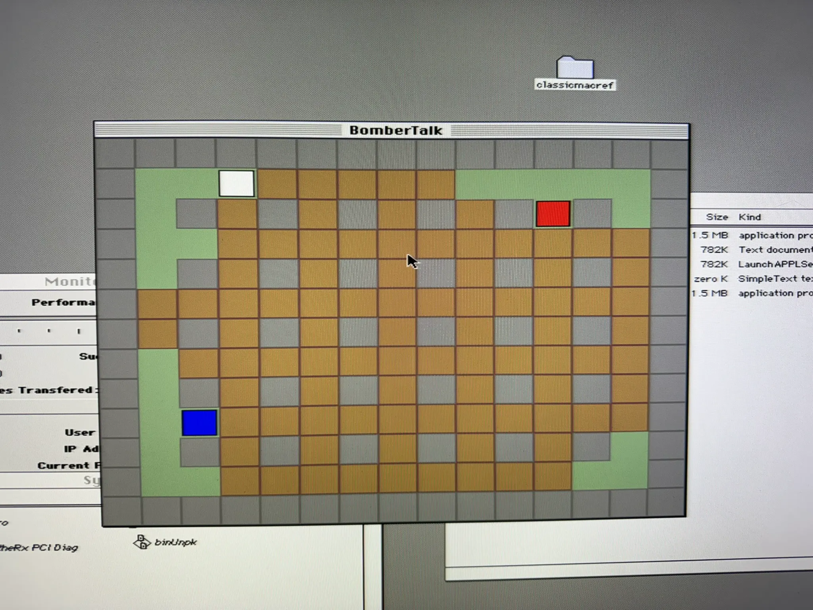
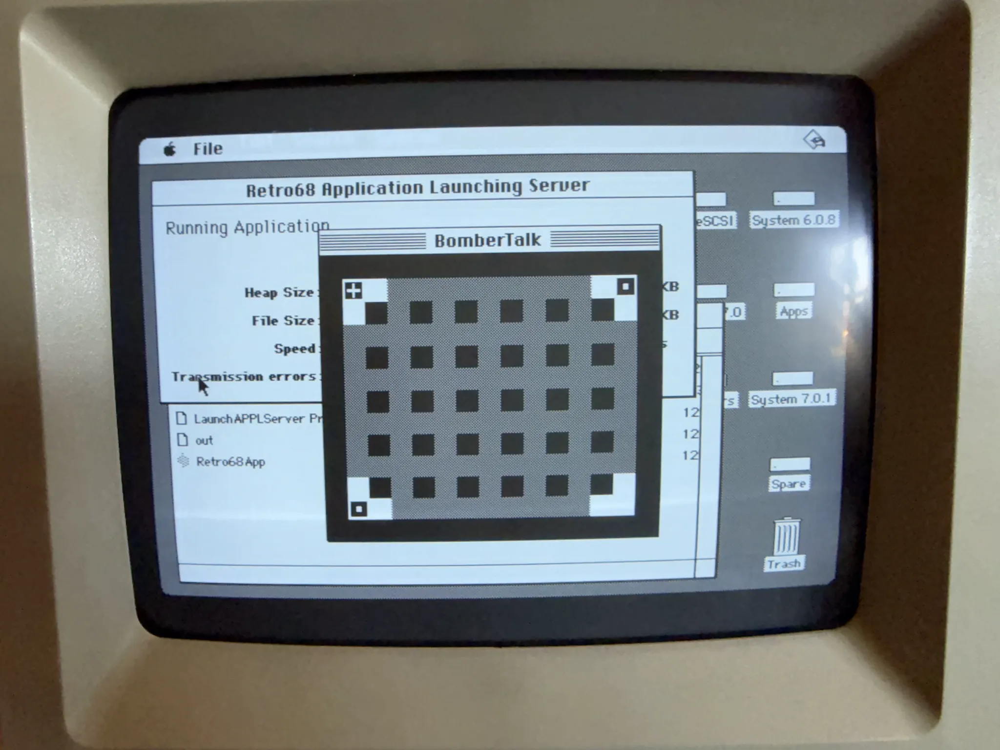
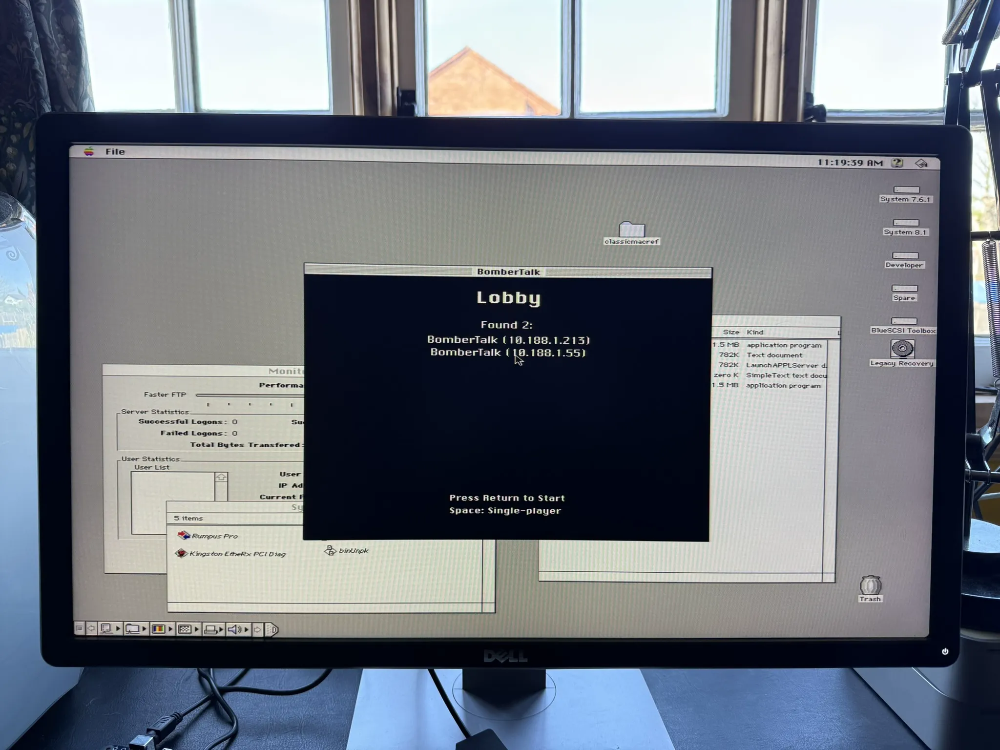

# BomberTalk

A networked Bomberman clone that plays across four generations of Mac — from a
1987 Mac SE to a modern Apple Silicon laptop — **all in the same match at the
same time**. It's the reference application for the
[PeerTalk](https://github.com/matthewdeaves/peertalk) SDK: if a monochrome
68000 Mac SE and a modern Linux box can share a game of Bomberman with bombs,
blocks, and kills all staying in sync, PeerTalk works.

Read the full write-up: [BomberTalk Alpha](https://matthewdeaves.com/blog/2026-04-06-bombertalk-alpha/)

<p align="center">
  
  
</p>
<p align="center">
  <em>Performa 6400 (colour, 32×32 tiles) and Mac SE (monochrome, 16×16 tiles) running the same game</em>
</p>

<p align="center">
  
</p>
<p align="center">
  <em>Lobby — peers are discovered automatically via UDP broadcast</em>
</p>

## Where it runs

| Platform | CPU | System | Backend | Build dir |
|----------|-----|--------|---------|-----------|
| Mac SE | 68000 8 MHz, 4 MB | System 6.0.8 | MacTCP, 1-bit mono | `build-68k/` |
| Performa 6200 | PPC 603 | System 7.5.3 | MacTCP | `build-ppc-mactcp/` |
| Performa 6400 | PPC 603e | System 7.6.1 | Open Transport | `build-ppc-ot/` |
| Mac OS X 10.3–10.7 | PPC **and** Intel | Carbon (fat `.app`) | `build-macosx/` |
| Linux / modern macOS | any | SDL2 | `build-sdl/` |

Every one of these plays with every other. The classic Macs and the PowerPC
OS X build are **big-endian**; the Intel and Apple-Silicon builds are
**little-endian**. PeerTalk's wire format keeps them in agreement, so a vintage
Mac and a modern laptop see the same board.

## Features

- **2–4 player LAN gameplay, no host** — PeerTalk forms the full TCP mesh
  automatically; any player can start the match.
- **One game core, many machines** — the shared C89 game logic is identical
  everywhere; only the rendering, input, and main-loop backends are swapped
  (Classic Toolbox, Carbon, or SDL2).
- **Cross-era and cross-endian** — a 68000 Mac and an Apple Silicon laptop
  play the same match, in sync, at the same time.
- **Automatic peer discovery** over UDP, with a lobby that shows who's around.
- **Join a game in progress** — late players seat in a free corner and inherit
  the current board.
- Smooth pixel-level movement, dirty-rectangle rendering, and a dedicated
  1-bit monochrome path for the Mac SE.
- **Host-tested core** — the portable game logic (collision, movement, network
  coordinate math, map parsing, win conditions) has a native unit-test suite
  that runs with no Mac hardware.

## Prerequisites

- [Retro68](https://github.com/matthewdeaves/Retro68) cross-compiler
  (`$RETRO68_TOOLCHAIN`) for the Classic Mac builds.
- `libsdl2-dev` + `pkg-config` for the SDL2 build.
- A vintage OS X host (10.4–10.7 with the 10.4u SDK) for the Carbon `.app`.

[clog](https://github.com/matthewdeaves/clog) and
[PeerTalk](https://github.com/matthewdeaves/peertalk) are fetched and built
automatically via CMake FetchContent. To use local checkouts, pass
`-DCLOG_DIR=path` and/or `-DPEERTALK_DIR=path`.

For deploying to real Classic Mac hardware from Claude Code, set up the
[classic-mac-hardware-mcp](https://github.com/matthewdeaves/classic-mac-hardware-mcp)
server (see its README).

## Building

### Classic Macs (Retro68)

```bash
# 68k MacTCP — Mac SE
mkdir -p build-68k && cd build-68k
cmake .. -DCMAKE_TOOLCHAIN_FILE=$RETRO68_TOOLCHAIN/m68k-apple-macos/cmake/retro68.toolchain.cmake && make

# PPC Open Transport — Performa 6400
mkdir -p build-ppc-ot && cd build-ppc-ot
cmake .. -DCMAKE_TOOLCHAIN_FILE=$RETRO68_TOOLCHAIN/powerpc-apple-macos/cmake/retroppc.toolchain.cmake \
  -DPT_PLATFORM=OT && make

# PPC MacTCP — Performa 6200
mkdir -p build-ppc-mactcp && cd build-ppc-mactcp
cmake .. -DCMAKE_TOOLCHAIN_FILE=$RETRO68_TOOLCHAIN/powerpc-apple-macos/cmake/retroppc.toolchain.cmake \
  -DPT_PLATFORM=MACTCP && make
```

### Modern desktop (SDL2 — Linux & Apple Silicon macOS)

```bash
PEERTALK_DIR=~/peertalk CLOG_DIR=~/clog bash tools/build-sdl.sh   # -> build-sdl/BomberTalk
```

### Mac OS X (Carbon fat `.app`, PPC + Intel)

Built on a vintage OS X 10.4–10.7 host with `tools/build-macosx.sh` — produces
`build-macosx/BomberTalk.app` (a universal ppc+i386 bundle that runs on
10.3–10.7).

## Remote Log Monitoring

Every build broadcasts debug messages over PeerTalk's debug channel (UDP port
7356) — player movement, bomb events, network TX/RX, and screen transitions are
all instrumented. Listen from any machine on the LAN:

```bash
socat -u UDP-RECV:7356,reuseaddr -
```

## Project Structure

```
include/       # Headers — game.h is the master (constants, types, resource IDs)
src/           # Shared C89 game core + swappable backends
               #   renderer/input/main/time for Classic, Carbon (BT_CARBON),
               #   and SDL2/POSIX (BT_POSIX)
tests/         # Native host unit tests for the portable core (no Mac needed)
maps/          # Level data
resources/     # Rez files (MENU, SIZE, sprites)
books/         # Classic Mac game programming reference books
specs/         # Design artifacts (spec, plan, tasks, data model, contracts)
```

## Design Principles

1. Every feature proves PeerTalk works on real hardware
2. Single game core — if a change breaks any target, it doesn't ship
3. C89 everywhere for Retro68 compatibility (backends target C89 where practical)
4. All memory pre-allocated at init, zero malloc during gameplay
5. Poll-based I/O on all platforms (no threads)
6. The [books](books/) are gospel — consult before implementing any subsystem

## Dependencies

[Retro68](https://github.com/matthewdeaves/Retro68) (setup.sh) → [clog](https://github.com/matthewdeaves/clog) + [PeerTalk](https://github.com/matthewdeaves/peertalk) (auto-fetched) → BomberTalk
